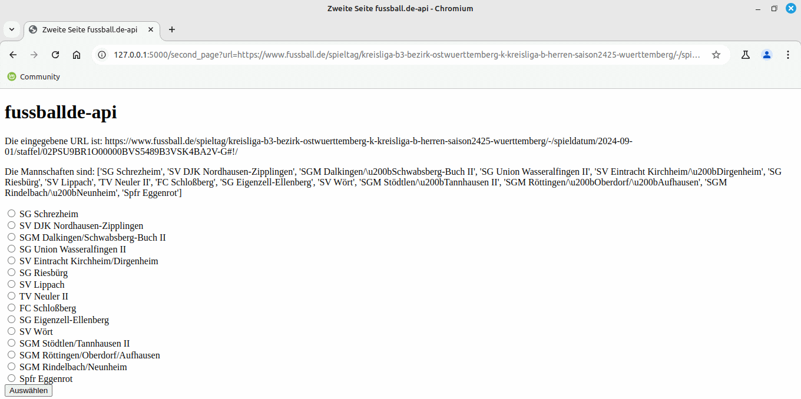

# lockertunes-fussballde-api

Get data about your team from [fussball.de](https://www.fussball.de).

## How to use api

Start with ```python .\lockertunes-fussballde-api-main\main.py```
Browser to 127.0.0.1:5000

This API contains following endpoints:

- /get-teams/`league_url: string`
- /get-matches/`team_name: string`/`league_url: string`/`game_span: int`

for Example: 127.0.0.1:5000/get-teams/....

### Formatting

- Url's should be sent without `https://www.fussball.de/`
- Slashes should be replaced with `SLASH`
- Spaces should be replaced with `SPACE`

## How to use GUI

start with: [127.0.0.1:5000]




